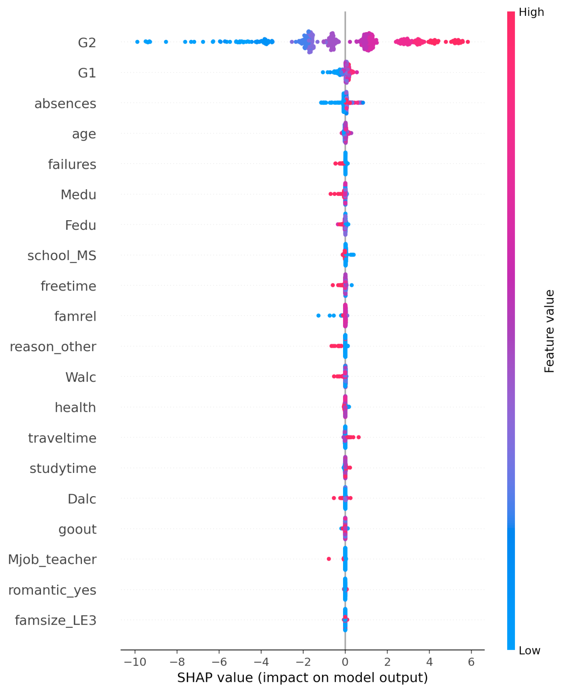

# student-performance-xai
# Explainable Machine Learning for Student Performance Prediction

This repository contains the code and experiments for an explainable AI study
on the UCI Student Performance dataset. Its focused on hypothesis-driven explainability, interaction
effects, and counterfactual explanations.

## The data
[UCI Student Performance dataset on kaggle](https://www.kaggle.com/datasets/larsen0966/student-performance-data-set/data).
Citation for dataset:
P. Cortez and A. Silva. Using Data Mining to Predict Secondary School Student Performance. In A. Brito and J. Teixeira Eds., Proceedings of 5th FUture BUsiness TEChnology Conference (FUBUTEC 2008) pp. 5-12, Porto, Portugal, April, 2008, EUROSIS, ISBN 978-9077381-39-7.


## Running the project 
### Option A: using Makefile
#### Installation of dependencies
`make install`
#### Downloading the data
`make data` 
Note: You will need a kaggle API token to download the dataset OR you can manually download it and place it in the `data/raw/` folder.
#### Starting the app
`make app`

### Option B: manual
```
pip install -r requirements.txt
pip install -e .
python scripts/download_dataset.py # again: requires kaggle API token
streamlit run student_performance_xai/app/app.py
```

## Visualizations
The visualizations for the explainability analyses are built using Streamlit and can be accessed by running the app as described above. The app provides interactive plots and explanations for the student performance prediction models.
Here are some example visualizations:

<p align="center">
  
  <br>
  <em>Figure 1: Global SHAP feature importance</em>
</p>
